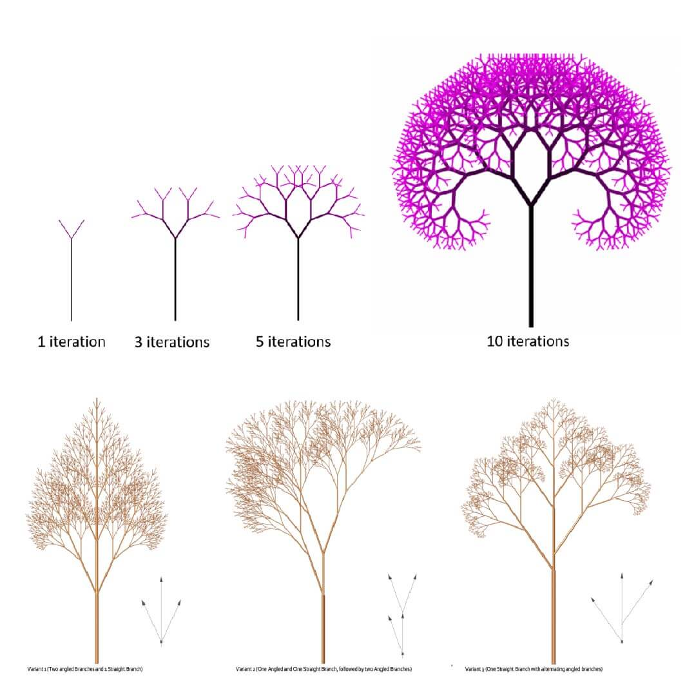

# Paralelizacija algoritma za generisanje fraktalnog stabla

**Predmet:** Napredne tehnike programiranja

**Ocena** za koju se radi projektni zadatak: 10

## Opis problema

**Binarno fraktalno stablo** je rekurzivna struktura definisana simetričnim binarnim grananjem. Stablo počinje sa deblom određene dužine koje se deli na dve grane, od kojih svaka ima dužinu `r × parent_length` i zaklapa određeni ugao sa roditeljskom granom. Svaka od ovih grana se dalje deli na još dve grane manje dužine, i tako rekurzivno dok dužina grane ne postane manja od zadatog praga.

Generisanje fraktalnog stabla je računski intenzivan proces, posebno za velika stabla sa mnogo nivoa rekurzije. Međutim, ovaj problem ima mogućnost **paralelizacije** - svaka grana može nezavisno da generiše svoje podstablo, što omogućava podelu posla između više procesnih jezgara.

## Cilj projekta

Cilj projekta je:

1. **Implementirati algoritam** za generisanje binarnog fraktalnog stabla
2. **Paralelizovati algoritam** korišćenjem modernih tehnika paralelnog programiranja
3. **Uporediti performanse** sekvencijalne i paralelne verzije
4. **Implementirati rešenje u dva jezika**: Python i Rust
5. **Vizualizovati** generisano fraktalno stablo

## Metode i tehnologije

### Python implementacija

**Sekvencijalna verzija:**

- Klasična rekurzivna implementacija bez paralelizacije
- Koristi matematičke formule za izračunavanje pozicija grana
- Čuva strukturu stabla kao listu `Node` objekata
- **Postupak generisanja:** Za svaki čvor sa pozicijom `(x, y)` i granom određene dužine algoritam:
  1. Smanjuje dužinu grane množenjem sa određenim faktorom
  2. Izračunava dva nova ugla
  3. Koristeći trigonometrijske funkcije, izračunava pozicije potomaka
  4. Rekurzivno poziva funkciju za levo i desno podstablo
  5. Zaustavlja se kada dužina grane padne ispod postavljenog praga

**Paralelna verzija:**

- **Biblioteka:** `multiprocessing`
- **Strategija paralelizacije:** Kontrolisano stvaranje procesa na prvim nivoima stabla
- **Broj nivoa paralelizacije:** ograničen, jer bi dublja paralelizacija dovela do overhead-a
- Svaki proces dobija svoj deo stabla za obradu
- Sinhronizacija preko `multiprocessing.Queue` za prikupljanje rezultata

### Rust implementacija

**Sekvencijalna verzija:**

- Rekurzivna implementacija koja čuva čvorove stabla u `Vec<Node>` strukturi. Koristi matematičke formule za izračunavanje pozicija grana na osnovu uglova i dužina.

**Paralelna verzija:**

- **Biblioteka:** [Rayon](https://github.com/rayon-rs/rayon) - omogućava data-parallelism kroz automatski thread pool
- **Pristup:** Koristiće se `rayon::join()` koji automatski paralelizuje levo i desno podstablo. Za razliku od Python-ovog pristupa sa kontrolisanim spawnovanjem procesa, Rayon dinamički odlučuje kada koristiti paralelizaciju, smanjujući overhead.

### Vizualizacija

Vizualizacija će biti urađena sa bibliotekom [Plotters](https://github.com/plotters-rs/plotters). Nakon što algoritam generiše strukturu stabla (svaki čvor sadrži svoju poziciju (x, y) i referencu na roditeljski čvor), Plotters biblioteka će:

1. Učitati sve generisane čvorove stabla
2. Za svaki čvor nacrtati liniju koja ga povezuje sa njegovim roditeljskim čvorom
3. Prikazati čvorove kao male tačke ili krugove na njihovim pozicijama

Finalna vizualizacija prikazuje kompletno fraktalno stablo sa svim granama i biće eksportovana u PNG format.

### Merenje performansi

Performanse će biti merene kroz sledeće eksperimente:

**Metrika:**

- **Vreme izvršavanja** - ukupno vreme potrebno za generisanje kompletnog fraktalnog stabla (od početka rekurzije do kraja)
- **Speedup** - odnos vremena sekvencijalne i paralelne verzije u istom jeziku

1. **Poređenje Python verzija:** Merenje razlike između Python sekvencijalne i paralelne implementacije
2. **Poređenje Rust verzija:** Merenje razlike između Rust sekvencijalne i paralelne implementacije

**Varijabilni parametri:**

- Različite dubine stabla (broj nivoa rekurzije)
- Različiti uglovi grananja
- Različiti faktori smanjenja dužine grana

Cilj je pokazati u kojim scenarijima paralelizacija daje najviše koristi i koje su razlike između process-based (Python) i thread-based (Rust) paralelizacije.

**Testna platforma:**

- Procesor: Intel(R) Core(TM) i5-1035G1 CPU @ 1.00GHz 1.19 GHz
- Python verzija: 3.11
- Rust verzija: 1.91

## Reference

- [Rayon - Data parallelism library](https://github.com/rayon-rs/rayon)
- [Plotters - Rust plotting library](https://github.com/plotters-rs/plotters)
- [Python multiprocessing documentation](https://docs.python.org/3/library/multiprocessing.html)

---

**Ana Poparić SV 74/2021**
