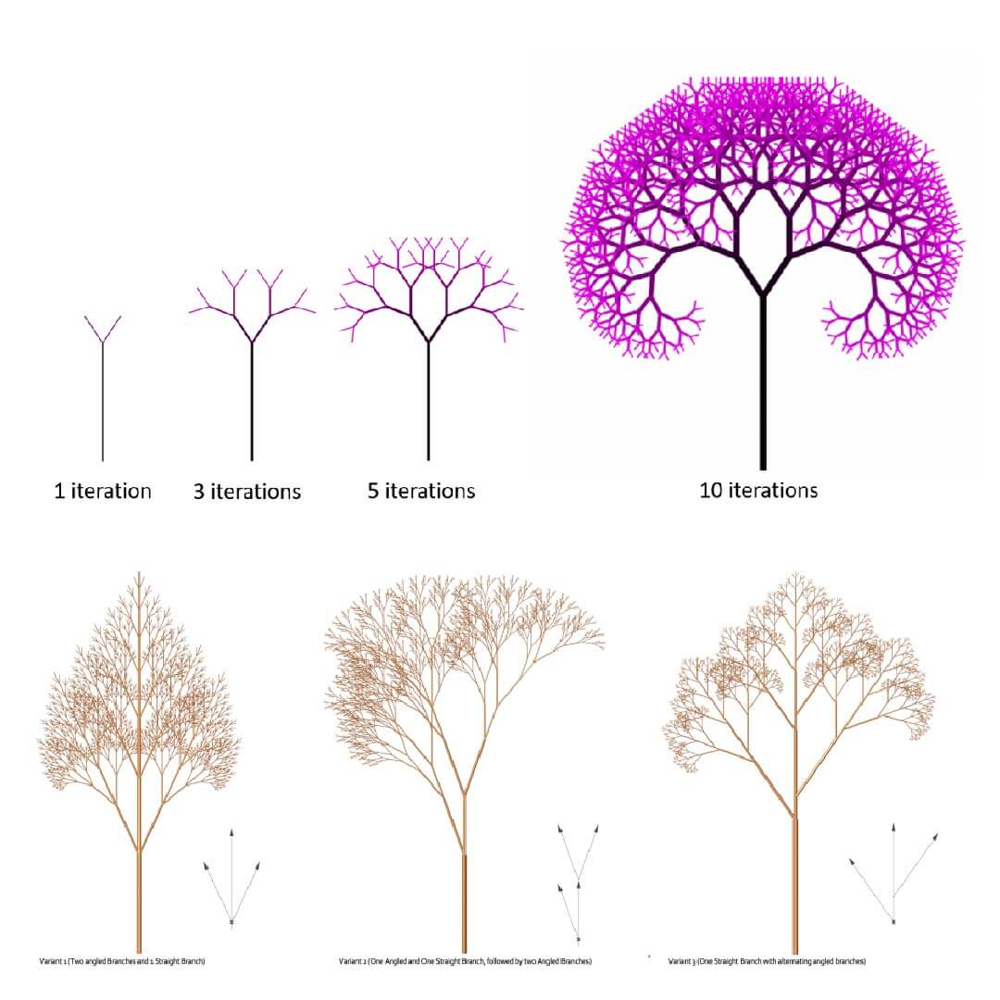

# Nadogradnja projekta: Paralelizacija algoritma za generisanje fraktalnog stabla

**Predmet:** Napredne tehnike programiranja

- Tema diplomskog rada: Paralelizacija simetricnog i asimetricnog fraktalnog stabla u programskom jeziku Rust VS u programskom jeziku Python

- Implementirati sekvencijalnu i paralelnu verziju algoritma generisanja 2 tipa fraktalnog stabla:
  - binarno simetricno
  - binarno asimetricno

- Objasniti razlike u performansama i izvuci **kljucne zakljucke**:
  - SIMETRICNO STABLO
    - sekvencijalna VS paralelna Python verzija (strong VS weak scaling) - [izvestaj](../FractalTreeParallelization/report.md)
    - sekvencijalna VS paralelna Rust verzija (strong VS weak scaling) - [izvestaj](../FractalTreeParallelization/report.md)
    - sekvencijalna Python verzija VS sekvencijalna Rust verzija
    - paralelna Python verzija VS paralelna Rust verzija
  - ASIMETRICNO STABLO
    - sekvencijalna VS paralelna Python verzija (strong VS weak scaling) - [izvestaj](../FractalTreeParallelization/report.md)
    - sekvencijalna VS paralelna Rust verzija (strong VS weak scaling) - [izvestaj](../FractalTreeParallelization/report.md)
    - sekvencijalna Python verzija VS sekvencijalna Rust verzija
    - paralelna Python verzija VS paralelna Rust verzija

- Napraviti eksperiment za **Varijabilni parametre:**
  - Različite dubine stabla (broj nivoa rekurzije)
  - Različiti uglovi grananja
  - Različiti faktori smanjenja dužine grana
