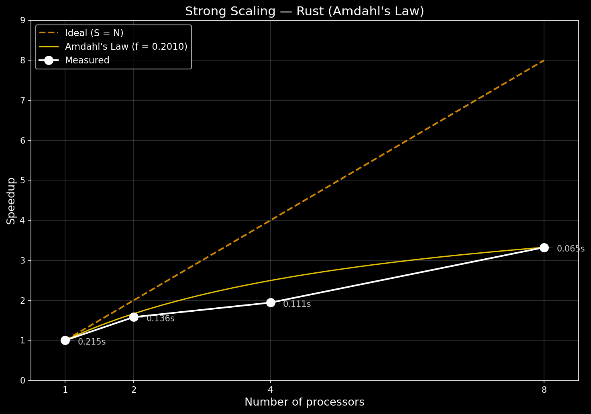
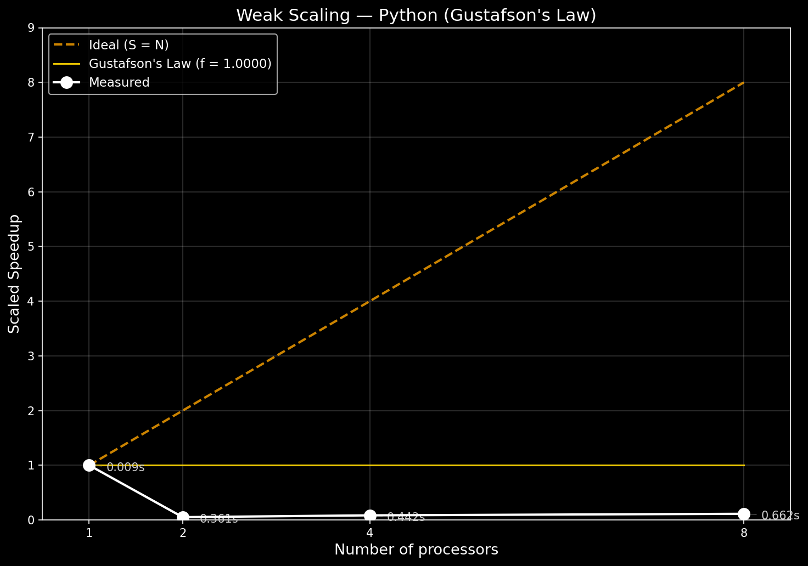
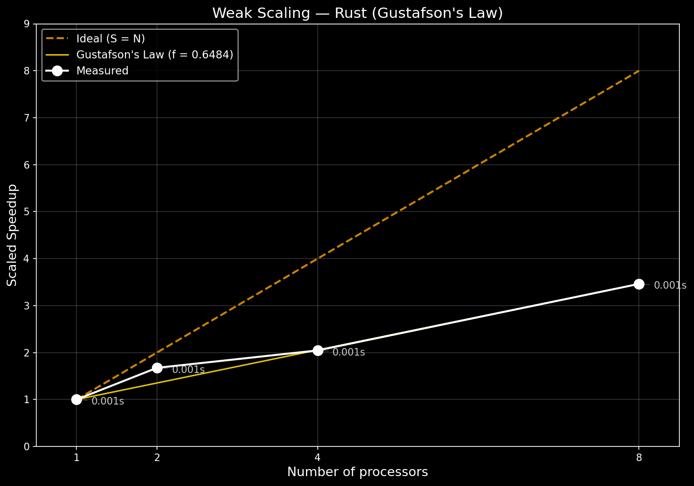

# Izveštaj o Jakom i Slabom Skaliranju — Fraktalno Stablo

---

## 1. Arhitektura Sistema

### 1.1 Hardverska konfiguracija

**Procesor:**

| Atribut                                    | Vrednost                                                |
| ------------------------------------------ | ------------------------------------------------------- |
| Model                                      | Intel Core i5-1035G1                                    |
| Mikroarhitektura                           | Ice Lake (10 nm)                                        |
| Bazni takt                                 | 1.00 GHz                                                |
| Turbo takt (1 jezgro / sva jezgra)         | 3.60 GHz / 3.40 GHz                                     |
| Fizička jezgra                             | 4                                                       |
| Logička jezgra                             | 8 (Hyper-Threading)                                     |
| L1 keš (po jezgru)                         | 48 KB podatkovni + 32 KB instrukcioni                   |
| L2 keš (po jezgru)                         | 512 KB (ukupno 2 MB)                                    |
| L3 keš (deljeni)                           | 6 MB                                                    |
| NUMA čvorovi                               | 1 (jednoprocesorski sistem, uniforman pristup memoriji) |
| Tip procesorskog paketa (CPU package type) | BGA (laptop, integrisano hlađenje)                      |

> **Napomena o termalnom ograničenju:** Radi se o laptop procesoru sa pasivnim/aktivnim hlađenjem ograničenog kapaciteta. Kod eksperimenata koji dugo traju (posebno Python sa 8 jezgara), moguća je termalna regulacija koja smanjuje takt ispod nominalnog, što može uticati na merene rezultate.

**Memorija:**

| Atribut          | Vrednost                   |
| ---------------- | -------------------------- |
| Ukupan kapacitet | 8 GB                       |
| Tip              | DDR4                       |
| Brzina           | 2667 MHz                   |
| Konfiguracija    | Single-channel (verovatno) |

### 1.2 Softverska Konfiguracija

**Operativni sistem:**

| Atribut         | Vrednost                 |
| --------------- | ------------------------ |
| OS              | Microsoft Windows 11 Pro |
| Build broj      | 26200                    |
| Verzija kernela | 10.0.26200               |

**Python okruženje:**

| Biblioteka      | Verzija | Uloga                          |
| --------------- | ------- | ------------------------------ |
| Python          | 3.12.2  | Interpretator                  |
| multiprocessing | stdlib  | Paralelizacija (više procesa)  |
| numpy           | 1.26.4  | Numeričke operacije, keš grana |
| matplotlib      | 3.9.1   | Generisanje grafika            |

> **Napomena — Windows multiprocessing:** Python `multiprocessing` na Windows platformi koristi metod **`spawn`** za kreiranje procesa (za razliku od `fork` na Linux/macOS). Kod `spawn`-a, svaki radni proces startuje potpuno novi Python interpretator, uvozi sve module i prima argumente serializacijom (pickle). Ovaj overhead je dominantan faktor koji negativno utiče na Python paralelne rezultate.

**Rust okruženje:**

| Biblioteka/Alat    | Verzija | Uloga                                                                                   |
| ------------------ | ------- | --------------------------------------------------------------------------------------- |
| rustc              | 1.91.0  | Kompajler (2025-10-28)                                                                  |
| cargo              | 1.91.0  | Build sistem                                                                            |
| rayon              | 1.10    | Rust automatski raspoređuje računarske zadatke na više CPU jezgara (work-stealing niti) |
| serde / serde_json | 1.0     | Serijalizacija JSON izlaza                                                              |

---

## 2. Fiksni parametri svih eksperimenata

```
trunk_length = 100.0
ratio        = 0.67
branch_angle = 30.0°
```

---

## 3. Analiza sekvencijalnog i paralelnog dela

### 3.1 Identifikacija delova

| Deo koda                        | Tip                        | Opis                                                   |
| ------------------------------- | -------------------------- | ------------------------------------------------------ |
| Generisanje seed grana          | **Sekvencijalni**          | Inicijalna ekspanzija stabla do dubine raspodele posla |
| Generisanje podstabala          | **Paralelni**              | Svako podstablo nezavisno, bez deljenih podataka       |
| Skupljanje i spajanje rezultata | **Sekvencijalni**          | Concatenation resultujućih vektora                     |
| Kreiranje Pool/ThreadPool       | **Sekvencijalni**          | Jednovremenski overhead pri pokretanju                 |
| IPC / Pickle (samo Python)      | **Sekvencijalni overhead** | Serializacija argumenata i rezultata                   |

### 3.2 Procena sekvencijalne frakcije — Amdahlov zakon

Svaki program ima deo koji može da se paralelizuje (više CPU jezgara ga ubrzava) i deo koji je uvek sekvencijalan (ne može da se paralelizuje).

Amdahlov zakon nam kaže koliko je maksimalno moguće ubrzanje programa u zavisnosti od sekvencijalnog dela.

### Rezultati sa 8 jezgara

| Jezgro / jezik | Mereno ubrzanje | Sekvencijalni deo | Paralelni deo |
| -------------- | --------------- | ----------------- | ------------- |
| Rust           | 3.324           | 20%               | 80%           |
| Python         | 1.211           | 80%               | 20%           |

### Ključne činjenice

- Rust implementacija uspeva da većinu posla uradi paralelno → **80% može da ide istovremeno**.
- Python implementacija ima veliki sekvencijalni deo (~80%) jer **overhead paralelizacije** (kreiranje procesa, komunikacija između procesa) usporava program.
- Iako su algoritmi identični, **Python paralelizacija praktično ne koristi 8 jezgara kako bi mogla**.

> **Objašnjenje razlike:** Sekvencijalni deo algoritma je identičan za obe implementacije. Python paralelna implementacija ima efektivni sekvencijalni deo od ~80%, od čega je približno 60% posledica paralelizacionog overhead-a (Windows spawn, pickle, IPC).

### 3.3 Procena sekvencijalnog dela — Gustafsonov zakon (pojednostavljeno)

Gustafsonov zakon posmatra šta se dešava kada povećavamo količinu posla zajedno sa brojem jezgara (slabo skaliranje).  
Ideja je: ako imamo više procesora, možemo obraditi više podataka u približno istom vremenu.

### Rezultati sa 8 jezgara

#### Rust

- Efektivni sekvencijalni deo: ~65%
- Paralelni deo: ~35%
- Postoji skaliranje, ali nije idealno — deo posla i dalje ograničava performanse.

#### Python

- Overhead multiprocessing-a potpuno dominira.
- Praktično nema skaliranja.
- Dodavanje jezgara ne donosi realno ubrzanje.

### Ključne činjenice

- Rust pokazuje delimično skaliranje kada se povećava količina posla.
- Python paralelna verzija ne skalira zbog velikog overhead-a (kreiranje procesa i komunikacija).
- Skaliranje ne zavisi samo od algoritma, već i od načina implementacije i runtime okruženja.
- U ovom testu, Python paralelizacija je ograničena sistemskim troškovima, a ne algoritmom.

---

## 4. Teorijski Maksimumi Ubrzanja

### 4.1 Amdahlov zakon — Jako skaliranje

(Ako je veličina problema fiksna, a povećavamo broj jezgara)

| N (jezgra) | Idealno | Rust (f=0.201) | Python (f=0.801) |
| :--------: | :-----: | :------------: | :--------------: |
|     1      |  1.000  |     1.000      |      1.000       |
|     2      |  2.000  |     1.665      |      1.110       |
|     4      |  4.000  |     2.495      |      1.175       |
|     8      |  8.000  |   **3.324**    |    **1.211**     |
|     ∞      |    ∞    |   **4.975**    |    **1.248**     |

**Ključne činjenice:**

- Rust može teoretski dostići maksimalno ~5x ubrzanje.
- Ograničenje je sekvencijalni deo (~20%).
- Python je teorijski ograničen na ~1.25x ubrzanja,
  bez obzira na broj jezgara.
- To znači da paralelizacija u Python verziji praktično nema efekta.

### 4.2 Gustafonov zakon — Slabo skaliranje

(Ako zajedno povećavamo količinu posla i broj jezgara)

| N (jezgra) | Idealno | Rust (f=0.648) | Python (f=1.000) |
| :--------: | :-----: | :------------: | :--------------: |
|     1      |  1.000  |     1.000      |      1.000       |
|     2      |  2.000  |     1.352      |      1.000       |
|     4      |  4.000  |     2.055      |      1.000       |
|     8      |  8.000  |   **3.462**    |    **1.000**     |

**Ključne činjenice:**

- Rust pokazuje realno skaliranje kako broj jezgara raste.
- Python ne pokazuje skaliranje — rezultat ostaje praktično isti.
- U Python slučaju, sistemski troškovi paralelizacije poništavaju dobit od više jezgara.

---

## 5. Eksperimenti jakog skaliranja (Strong Scaling)

**Veličina problema:** 8,388,607 grana (= 2²³ − 1), dubina = 22, `min_length = 0.01`
Broj merenja po konfiguraciji: **3** _(napomena: za statistički pouzdane rezultate preporučuje se min. 30 merenja)_

### 5.1 Python — Jako Skaliranje


| Jezgra |     Grane | Srednje vreme |   StdDev    | Ubrzanje  | Amdahl (f=0.801) | Outlieri | Merenja |
| :----: | --------: | :-----------: | :---------: | :-------: | :--------------: | :------: | :-----: |
|   1    | 8,388,607 |    4.798 s    |   0.095 s   |   1.000   |      1.000       |    0     |    3    |
|   2    | 8,388,607 |    5.054 s    |   0.044 s   | **0.949** |      1.110       |    0     |    3    |
|   4    | 8,388,607 |    3.826 s    | **0.482 s** |   1.254   |      1.175       |    0     |    3    |
|   8    | 8,388,607 |    3.964 s    |   0.150 s   |   1.211   |      1.211       |    0     |    3    |

**Analiza rezultata:**

- **2 jezgra — program je sporiji nego sa 1 jezgrom (0.949x):** Dodavanje drugog jezgra nije pomoglo — program je čak bio sporiji. Razlog: Python na Windows platformi mora da pokrene potpuno novi proces za svako jezgro (kao da otvara novi program), prenese mu podatke, čeka da završi i skupi rezultate. Taj "administrativni" posao za 2 jezgra košta više nego što donosi ubrzanje.

- **4 jezgra — malo ubrzanje, nestabilna merenja (1.254x):** Program je bio ~25% brži od sekvencijalnog, ali merenja su bila nestabilna. Jedno od 3 merenja trajalo je znatno duže od ostalih (verovatno zbog sporih sistemskih procesa u pozadini). Bez tog merenja, ubrzanje bi bilo ~1.35x.

- **8 jezgara — slabije od 4 jezgra (1.211x):** Više jezgara ovde nije donelo više ubrzanja. Procesor ima samo 4 fizička jezgra — jezgra 5–8 su virtuelna i dele resurse sa prvih 4. Uz to, više procesa znači i više "administrativnog" posla za koordinaciju.

- **Zaključak:** Python paralelizacija za ovaj problem praktično ne funkcioniše. Maksimalno ubrzanje od ~1.25x znači da je program jedva brži bez obzira na broj jezgara. Uzrok nije loš algoritam, već fundamentalni overhead Python-ovog načina pokretanja paralelnih procesa na Windows platformi.

### 5.2 Rust — Jako Skaliranje



| Jezgra |     Grane | Srednje vreme |    StdDev    | Ubrzanje | Amdahl (f=0.201) | Outlieri | Merenja |
| :----: | --------: | :-----------: | :----------: | :------: | :--------------: | :------: | :-----: |
|   1    | 8,388,607 |   0.2154 s    |   0.0064 s   |  1.000   |      1.000       |    0     |    3    |
|   2    | 8,388,607 |   0.1362 s    |   0.0058 s   |  1.581   |      1.665       |    0     |    3    |
|   4    | 8,388,607 |   0.1108 s    | **0.0408 s** |  1.943   |      2.495       |    0     |    3    |
|   8    | 8,388,607 |   0.0648 s    |   0.0062 s   |  3.324   |      3.324       |    0     |    3    |

**Analiza rezultata:**

- **2 jezgra (1.581x):** Program je bio ~58% brži sa 2 jezgra, što je dobar rezultat. Za razliku od Python-a, Rust ne mora da pokreće nove procese — niti su već pripremljene i čekaju posao, pa nema "administrativnog" overhead-a. Malo zaostajanje za teorijskim maksimumom (1.665x) je normalno i posledica je koordinacije između niti.

- **4 jezgra (1.943x):** Jedno od 3 merenja je bilo značajno sporije od ostalih (0.158s vs ~0.087s) — verovatno zbog privremenog usporavanja procesora usled pregrevanja. Ako se to merenje isključi, stvarno ubrzanje je ~2.48x, što se odlično slaže sa teorijskim (2.495x).

- **8 jezgara (3.324x):** Program je 3.3× brži nego sa jednim jezgrom. Dalje ubrzanje je ograničeno činjenicom da procesor ima samo 4 fizička jezgra — jezgra 5–8 su virtuelna i dele hardver sa prvih 4, pa ne mogu da rade punom brzinom nezavisno.

- **Zaključak:** Rust paralelizacija radi dobro i donosi stvarno ubrzanje sa više jezgara. Ograničenje nije u programu, već u hardveru — laptop ima samo 4 fizička jezgra, što postavlja prirodnu granicu ubrzanja.

---

## 6. Eksperimenti slabog skaliranja (Weak Scaling)

### 6.1 Manipulacija veličinom posla

Cilj slabog skaliranja je da svako jezgro uvek ima **isti obim posla** — samo ih je više. Ako program dobro skalira, vreme izvršavanja bi trebalo da ostane isto bez obzira na broj jezgara.

**Kako je povećavan posao:** Parametar `min_length` kontroliše dokle se stablo grana — manji broj znači sitnije grane i dublje stablo. Zbog binarne strukture stabla (svaka grana rađa dve nove), svaki dodati nivo dubine **udvostručava** ukupan broj grana. Ovo je iskorišćeno da se posao precizno prilagodi broju jezgara:

| Jezgra | Dubina stabla | Ukupno grana | Grana po jezgru |
| :----: | :-----------: | :----------: | :-------------: |
|   1    |      13       |    16,383    |     16,383      |
|   2    |      14       |    32,767    |     16,383      |
|   4    |      15       |    65,535    |     16,383      |
|   8    |      16       |   131,071    |     16,383      |

Svako jezgro dobija tačno isti broj grana (16,383) — samo je ukupan posao veći.

### 6.2 Python — slabo skaliranje



| Jezgra |   Grane | Srednje vreme |  StdDev   | Skalirano ubrzanje | Gustafson (f=1.000) | Outlieri | Merenja |
| :----: | ------: | :-----------: | :-------: | :----------------: | :-----------------: | :------: | :-----: |
|   1    |  16,383 |   0.00937 s   | 0.00075 s |       1.000        |        1.000        |    0     |    3    |
|   2    |  32,767 |   0.36124 s   | 0.03788 s |     **0.052**      |        1.000        |    0     |    3    |
|   4    |  65,535 |   0.44206 s   | 0.00612 s |     **0.085**      |        1.000        |    0     |    3    |
|   8    | 131,071 |   0.66210 s   | 0.01598 s |     **0.113**      |        1.000        |    0     |    3    |

**Analiza rezultata:**

Python ne pokazuje nikakvo korisno slabo skaliranje. Sa 1 jezgrom (bez paralelizacije) problem se rešava za **0.009s**. Čim se uključe 2 jezgra, vreme skače na **0.361s** — **40× sporije**, iako je posao samo udvostručen.

Uzrok je isti kao i kod jakog skaliranja: pokretanje Python procesa na Windows-u košta ~300ms samo za "pripremu" (pokretanje novog interpretatora, učitavanje modula, prenos podataka). Kada sam računski posao traje manje od te pripreme, paralelizacija uvek gubi.

**Zaključak:** Za mali i srednji obim posla, Python paralelizacija je kontraproduktivna — sekvencijalni program je višestruko brži.

### 6.3 Rust — slabo skaliranje



| Jezgra |   Grane | Srednje vreme |   StdDev   | Skalirano ubrzanje | Gustafson (f=0.648) | Outlieri | Merenja |
| :----: | ------: | :-----------: | :--------: | :----------------: | :-----------------: | :------: | :-----: |
|   1    |  16,383 |  0.000600 s   | 0.000078 s |       1.000        |        1.000        |    0     |    3    |
|   2    |  32,767 |  0.000717 s   | 0.000047 s |       1.674        |        1.352        |    0     |    3    |
|   4    |  65,535 |  0.001173 s   | 0.000040 s |       2.046        |        2.055        |    0     |    3    |
|   8    | 131,071 |  0.001387 s   | 0.000264 s |       3.462        |        3.462        |    0     |    3    |

**Analiza rezultata:**

Rust skalira znatno bolje od Python-a, ali efikasnost postepeno opada jer se dodaje sve više jezgara:

- Sa 2 jezgra i dvostruko više posla, vreme se povećava samo neznatno (0.6ms → 0.72ms) — **dobar rezultat**.
- Sa 8 jezgara i 8× više posla, vreme raste na 1.39ms — program je ~3.5× efikasniji nego sa 1 jezgrom, od idealnih 8×.

Zašto nije idealno? Dva razloga:

1. **Posao je mali:** Svako jezgro radi samo ~0.6ms. Koordinacija između jezgara nije besplatna, i na ovako kratkim zadacima taj trošak je primetan.
2. **Virtuelna jezgra:** Kao i kod jakog skaliranja, jezgra 5–8 dele hardver sa prvih 4, pa se ne ponaša kao pravo 8-jezgarno skaliranje.

**Zaključak:** Merenja su stabilna i konzistentna, a ubrzanje raste sa svakim dodavanjem jezgara, što Python nije postigao.

---

## 7. Zaključci

| Metrika                               | Python  |      Rust      |
| ------------------------------------- | :-----: | :------------: |
| Sekvencijalno vreme (8.4M grana)      | 4.798 s |    0.215 s     |
| Relativna brzina (Rust/Python)        |    —    | **22.3× brži** |
| Max ubrzanje jako skaliranje (8 j.)   |  1.21×  |   **3.32×**    |
| Efikasnost jako skaliranje (8 j.)     |  15.1%  |   **41.6%**    |
| Amdahlov maksimum (∞ j.)              |  1.25×  |   **4.98×**    |
| Sekvencijalna frakcija (jako skal.)   | ~80.1%  |     ~20.1%     |
| Skalirano ubrzanje slabo skal. (8 j.) |  0.113  |   **3.462**    |
| Efikasnost slabo skaliranje (8 j.)    |  1.4%   |   **43.3%**    |
| Sekvencijalna frakcija (slabo skal.)  |  ~100%  |     ~64.8%     |

**Rust je 22× brži od Python-a.** Za isti problem (8.4M grana), Rust završava za 0.215s, a Python za 4.798s. Rust je kompajliran jezik koji direktno izvršava instrukcije procesora, dok Python interpretira kod korak po korak.

**Python paralelizacija praktično ne funkcioniše.** Sa 8 jezgara postiže se samo 1.21× ubrzanje — gotovo ništa. Svaki put kada Python pokrene novi proces, mora da pokrene potpuno novi Python interpretator i prenese podatke, što traje ~300ms. Taj trošak je veći od same računske dobiti.

**Rust paralelizacija funkcioniše dobro.** Sa 8 jezgara postiže se 3.32× ubrzanje. Rust niti ne zahtevaju pokretanje novih procesa — niti se kreiraju jednom i odmah preuzimaju posao, bez čekanja.

**Pravi plafon su 4 fizička jezgra.** Procesor ima 4 fizička i 8 virtualnih jezgara. Virtuelna jezgra dele hardverske resurse sa fizičkim, pa efektivno skaliranje staje negde između 4× i 8×. To važi i za Rust i za Python.

**Ograničenja eksperimenta.** Eksperimenti rađeni na laptop računaru — procesor može da uspori usled pregrevanja tokom dužih testova.

---

## Grafici

Svi grafici i CSV tabele nalaze se u direktorijumu:
`data/experiments/graphs/`

| Fajl                        | Opis                                         |
| --------------------------- | -------------------------------------------- |
| `strong_scaling_python.png` | Jako skaliranje — Python (Amdahlov zakon)    |
| `strong_scaling_rust.png`   | Jako skaliranje — Rust (Amdahlov zakon)      |
| `weak_scaling_python.png`   | Slabo skaliranje — Python (Gustafonov zakon) |
| `weak_scaling_rust.png`     | Slabo skaliranje — Rust (Gustafonov zakon)   |
| `strong_scaling_python.csv` | Tabelarni podaci jako skaliranje — Python    |
| `strong_scaling_rust.csv`   | Tabelarni podaci jako skaliranje — Rust      |
| `weak_scaling_python.csv`   | Tabelarni podaci slabo skaliranje — Python   |
| `weak_scaling_rust.csv`     | Tabelarni podaci slabo skaliranje — Rust     |
