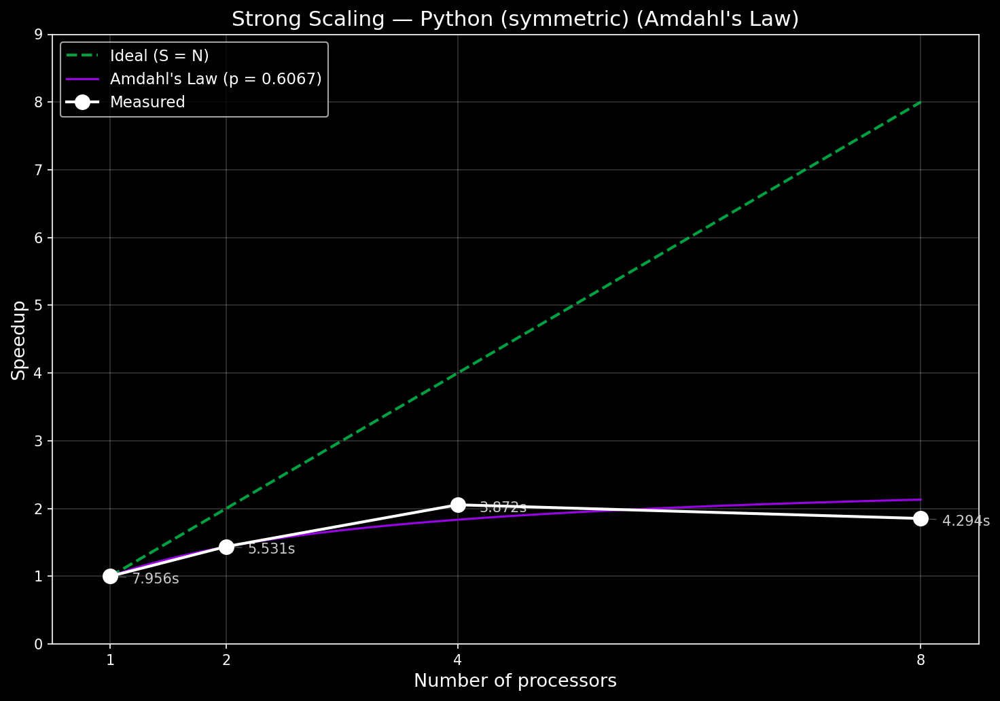
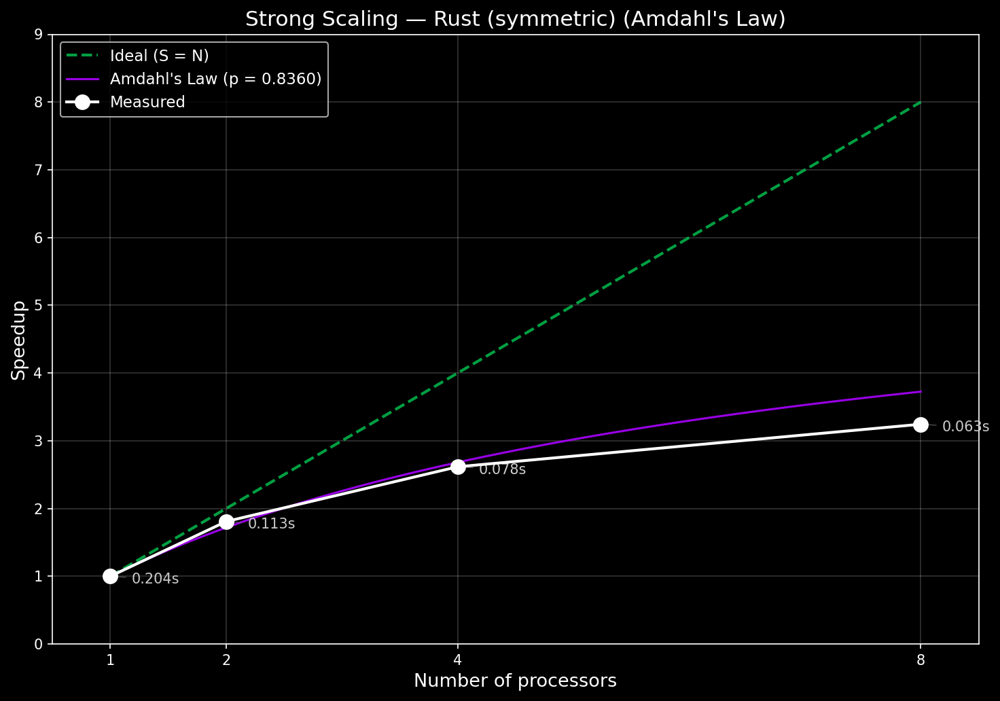
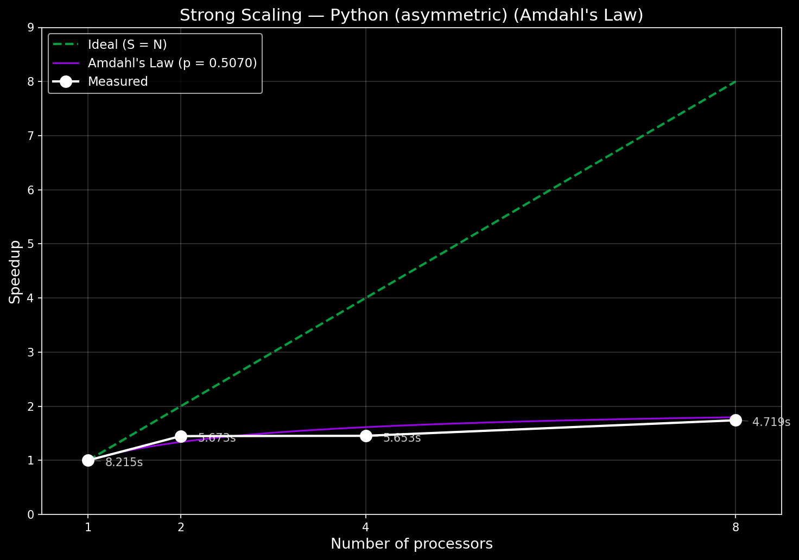
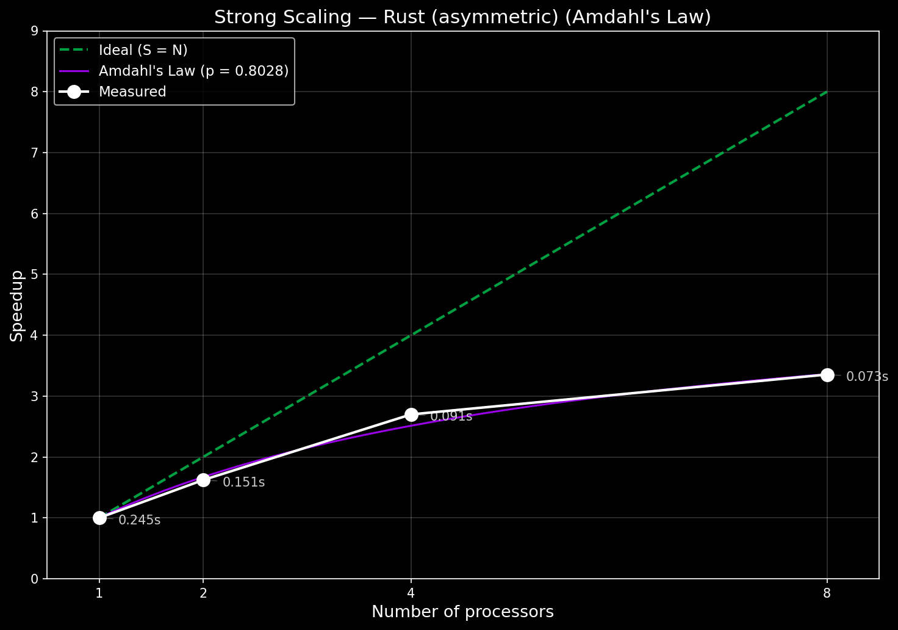
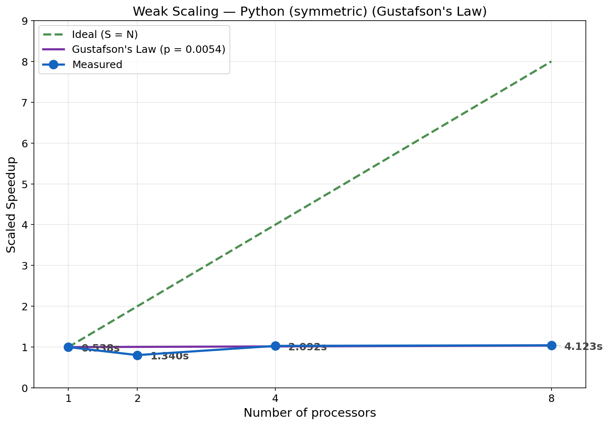
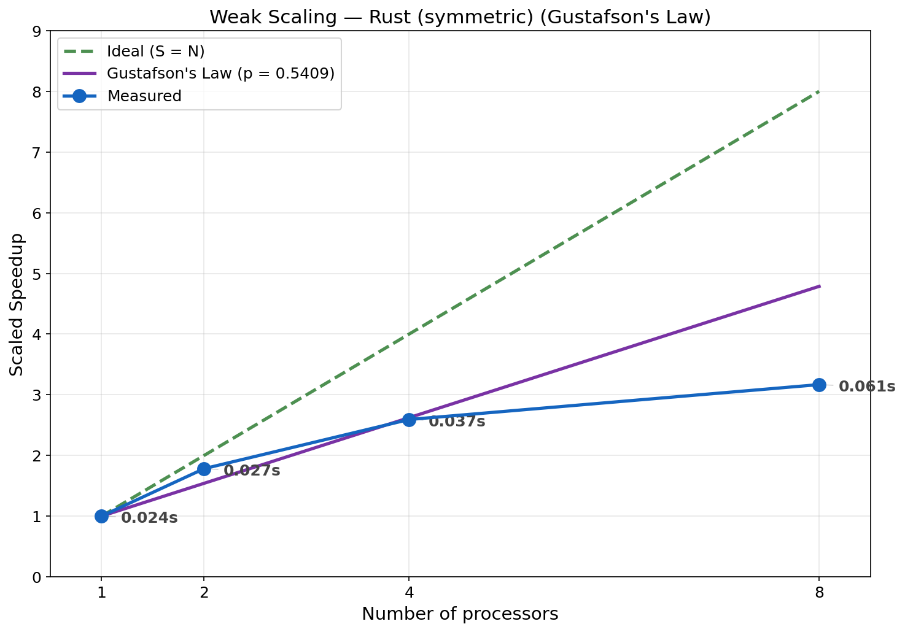
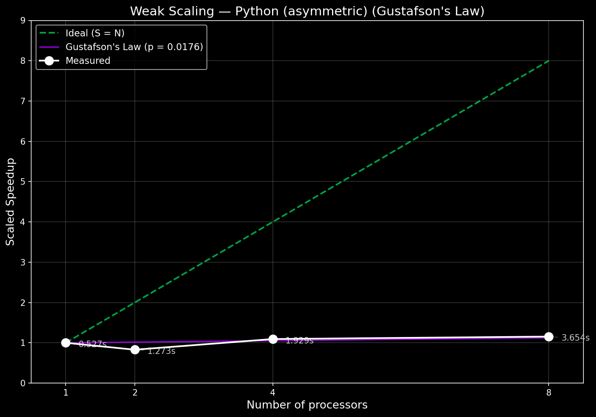
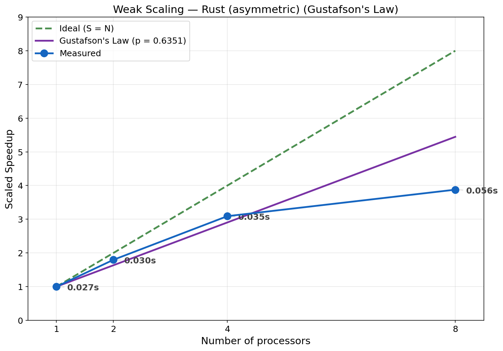

# Izveštaj o Jakom i Slabom Skaliranju — Fraktalno Stablo

---

## 1. Arhitektura Sistema

### 1.1 Hardverska konfiguracija

| Atribut                  | Vrednost                  |
| ------------------------ | ------------------------- |
| Model                    | Intel Core i5-1035G1      |
| Fizička / logička jezgra | 4 / 8 (Hyper-Threading)   |
| L2 keš (po jezgru)       | 512 KB                    |
| Memorija                 | 8 GB DDR4, single-channel |

**Napomena o termalnom ograničenju:** Eksperimenti su vršeni na laptop procesoru sa ograničenim kapacitetom hlađenja. Kod eksperimenata koji dugo traju, moguća je termalna regulacija koja može uticati na merene rezultate.

### 1.2 Softverska konfiguracija

| Komponenta    | Verzija        | Napomena                                  |
| ------------- | -------------- | ----------------------------------------- |
| OS            | Windows 11 Pro | —                                         |
| Python        | 3.11           | `multiprocessing` sa **spawn** metodom    |
| rayon         | 1.10           | Work-stealing niti za Rust paralelizaciju |
| rustc / cargo | 1.91.0         | —                                         |

**Napomena:** Python `multiprocessing` na Windows koristi metod **`spawn`** — svaki radni proces startuje potpuno novi Python interpretator i prima argumente serijalizacijom (pickle). Ovaj trošak je dominantan faktor koji ograničava Python paralelne performanse, za razliku od Rust-a koji koristi niti unutar jednog procesa.

---

## 2. Eksperimentalni parametri

```
trunk_length  = 100.0
ratio         = 0.67          (simetrično stablo)
left_ratio    = 0.67          (asimetrično stablo)
right_ratio   = 0.57          (asimetrično stablo)
branch_angle  = 30.0°
Broj merenja po konfiguraciji = 10
```

---

## 3. Analiza sekvencijalnog i paralelnog dela

### 3.1 Identifikacija sekvencijalnog i paralelnog dela

Svaka paralelna implementacija se sastoji od dva koraka:

1. **Sekvencijalni deo** — gornji nivoi stabla grade se jedan po jedan, bez paralelizacije. Broj jezgara ovde ne utiče na brzinu.
2. **Paralelni deo** — kada se dostigne određena dubina, svako podstablo postaje nezavisan zadatak koji se izvršava istovremeno na različitim jezgrima/nitima.

| Kod                             | Tip                        | Opis                                                   |
| ------------------------------- | -------------------------- | ------------------------------------------------------ |
| Generisanje seed grana          | **Sekvencijalni**          | Inicijalna ekspanzija stabla do dubine raspodele posla |
| Generisanje podstabala          | **Paralelni**              | Svako podstablo nezavisno, bez deljenih podataka       |
| Skupljanje i spajanje rezultata | **Sekvencijalni**          | Spajanje rezultujućih vektora                          |
| Kreiranje Pool/ThreadPool       | **Sekvencijalni**          | Jednokratni trošak pri pokretanju                      |
| IPC / Pickle (samo Python)      | **Sekvencijalni overhead** | Prenos podataka između procesa kroz operativni sistem  |

### 3.2 Procena paralelne frakcije

Vrednost p (paralelni deo) procenjena je iz izmerenih podataka, a sekvencijalni deo sledi direktno: f = 1 − p, jer zbir sekvencijalnog i paralelnog dela uvek čini 100% ukupnog vremena izvršavanja.

Oznake koje se koriste u formulama:

- `p` — udeo programa koji se može izvršavati paralelno (vrednost između 0 i 1)
- `f = 1 − p` — udeo programa koji mora da se izvršava sekvencijalno
- `N` — broj jezgara (procesora)
- `S` — izmereno ubrzanje: koliko puta je program brži sa N jezgara nego sa 1 jezgrom (`S = T(1) / T(N)`)
- `S_scaled` — skalirano ubrzanje kod slabog skaliranja: koliko više posla se završi u istom vremenu (`S_scaled = N · T(1) / T(N)`)

**Amdahlov zakon** (jako skaliranje): osnovna formula je `S = 1 / ((1−p) + p/N)`. Kada izmerimo S i znamo N, invertujemo je da bismo dobili p:
`(1−p) + p/N = 1/S  →  1 − p·(1−1/N) = 1/S  →  p = (1 − 1/S) / (1 − 1/N)`

**Gustafsonov zakon** (slabo skaliranje): osnovna formula je `S_scaled = 1 + p·(N−1)`. Invertovanjem:
`p·(N−1) = S_scaled − 1  →  p = (S_scaled − 1) / (N − 1)`, gde je `S_scaled = N · T(1) / T(N)`

---

## 4. Teorijski Maksimumi Ubrzanja

### 4.1 Amdahlov zakon — Jako skaliranje

Amdahlov zakon: ako `f`deo programa mora biti sekvencijalan, maksimalno ubrzanje (bez obzira na broj jezgara) iznosi `1/f`. Program koji je 10% sekvencijalan nikada ne može biti brži od 10× bez obzira na broj jezgara.

#### Simetrično stablo

| N (jezgra) | Idealno |   Rust   |  Python   |
| :--------: | :-----: | :------: | :-------: |
|   **p**    |    —    |  0.836   |   0.607   |
|     1      |  1.000  |  1.000   |   1.000   |
|     2      |  2.000  |  1.718   |   1.435   |
|     4      |  4.000  |  2.681   |   1.835   |
|     8      |  8.000  |  3.725   |   2.132   |
|     ∞      |    ∞    | **6.10** | **2.545** |

**Rust:** Amdahlov model predviđa ubrzanje 3.725× za 8 jezgara, dok je izmereno 3.244×. Odstupanje ukazuje na dodatna ograničenja pri većem broju jezgara, poput memorijske propusnosti, sinhronizacije niti i drugih sistemskih overhead-a koje model ne uzima u obzir.

**Python:** Izmerena ubrzanja blisko prate Amdahlov model za manji broj jezgara, ali pri 8 procesa dolazi do pada performansi u odnosu na 4 procesa. To ukazuje da overhead pokretanja i koordinacije procesa na Windows platformi postaje dominantan i smanjuje korist od dodatne paralelizacije. Sekvencijalni deo (`f ≈ 39.3%`) obuhvata i deo algoritma koji se izvršava sekvencijalno i trošak upravljanja `Pool` procesima.

#### Asimetrično stablo

| N (jezgra) | Idealno |   Rust   |  Python   |
| :--------: | :-----: | :------: | :-------: |
|   **p**    |    —    |  0.803   |   0.507   |
|     1      |  1.000  |  1.000   |   1.000   |
|     2      |  2.000  |  1.671   |   1.340   |
|     4      |  4.000  |  2.513   |   1.614   |
|     8      |  8.000  |  3.361   |   1.797   |
|     ∞      |    ∞    | **5.08** | **2.028** |

**Zašto je asimetrično stablo lošije i za Rust i za Python?**

- **Rust:** Asimetrično stablo pogoršava skaliranje u odnosu na simetrično, jer neravnomerna raspodela podstabala povećava efektivni sekvencijalni deo (`f` raste sa **16.4%** na **19.7%**). Iako Rayon koristi dinamičku raspodelu zadataka između niti, velika razlika u veličini podstabala dovodi do load imbalance efekta: neke niti završavaju ranije i čekaju završetak većih zadataka, što smanjuje efikasnost paralelizacije.

- Python: I kod Python implementacije dolazi do pogoršanja skaliranja (`f` raste sa **39.3%** na **49.3%**). Zbog asimetrične strukture stabla, veličine podzadataka su neujednačene, pa najsporiji proces određuje ukupno vreme izvršavanja i load imbalance postaje izraženiji nego kod simetričnog stabla. Izmereno ubrzanje na **8** procesa (**1.741×**) blago zaostaje za Amdahlovom predikcijom (**1.781×**).

### 4.2 Gustafsonov zakon — Slabo skaliranje

Gustafsonov zakon: kada se broj jezgara povećava, povećava se i veličina problema (svako jezgro uvek ima isto toliko posla). Pitanje je koliko više posla može da se završi u istom vremenu.

#### Simetrično stablo

| N (jezgra) | Idealno |   Rust    |  Python   |
| :--------: | :-----: | :-------: | :-------: |
|   **p**    |    —    |   0.541   |   0.005   |
|     1      |  1.000  |   1.000   |   1.000   |
|     2      |  2.000  |   1.541   |   1.005   |
|     4      |  4.000  |   2.623   |   1.016   |
|     8      |  8.000  | **4.787** | **1.038** |

**Rust:** Gustafsonov model predviđa skalirano ubrzanje od `4.693×` za 8 jezgara, dok je izmereno `3.068×`. Na 2 i 4 jezgra izmerene vrednosti su veoma bliske predikcijama, uz blago veće ubrzanje pri manjim radnim skupovima, što može ukazivati na povoljne cache efekte. Međutim, pri 8 jezgara dolazi do odstupanja od modela, verovatno zbog ograničenja memorijske propusnosti i smanjene efikasnosti Hyper-Threading-a pri većem opterećenju sistema.

**Python:** Veoma mala vrednost parametra `p = 0.015` pokazuje da je samo mali deo izvršavanja efektivno paralelizabilan. Na 2 procesa skalirano ubrzanje je manje od 1 (`0.858×`), što znači da overhead pokretanja i koordinacije procesa nadmašuje korist od paralelizacije. Na 4 i 8 procesa rezultati su bliski Gustafsonovim predikcijama, ali ukupno ubrzanje ostaje veoma malo, što ukazuje da povećanje veličine problema ne donosi značajnu korist za ovu implementaciju.

#### Asimetrično stablo

| N (jezgra) | Idealno |   Rust    |  Python   |
| :--------: | :-----: | :-------: | :-------: |
|   **p**    |    —    |   0.635   |   0.018   |
|     1      |  1.000  |   1.000   |   1.000   |
|     2      |  2.000  |   1.635   |   1.018   |
|     4      |  4.000  |   2.905   |   1.053   |
|     8      |  8.000  | **5.446** | **1.123** |

**Rust:** Asimetrično stablo pokazuje bolje slabo skaliranje od simetričnog (`p = 0.630` naspram `0.528`). Pri slabom skaliranju sa većim problemom raste i broj dostupnih zadataka, pa Rayon-ov work-stealing efikasnije raspoređuje opterećenje između niti. Zbog toga neravnomerna veličina podstabala ima manji uticaj nego kod jakog skaliranja. Ipak, izmereno ubrzanje na 8 jezgara (`3.781×`) ostaje ispod Gustafsonove predikcije (`5.413×`), što ukazuje na dodatne sistemske overhead-e koje model ne uzima u obzir.

**Python:** Rezultati za asimetrično i simetrično stablo ostaju veoma slični (`p = 0.017` naspram `0.015`). Na 2 procesa skalirano ubrzanje je manje od 1 (`0.829×`), što znači da overhead multiprocessing-a nadmašuje korist paralelizacije. Na 8 procesa izmereno ubrzanje (`1.131×`) blisko je Gustafsonovoj predikciji (`1.116×`). Oblik stabla ima mali uticaj na ukupne performanse, jer trošak pokretanja i koordinacije procesa ostaje dominantan faktor.

---

## 5. Jako skaliranje - Rezultati

**Veličina problema:** fiksna, `min_length = 0.01`

### 5.1 Simetrično stablo (8,388,607 grana)

### Python



| Jezgra |     Grane | Srednje vreme | StdDev  | Ubrzanje  | Amdahl (p=0.607) | Outlieri |
| :----: | --------: | :-----------: | :-----: | :-------: | :--------------: | :------: |
|   1    | 8,388,607 |    7.956 s    | 0.133 s |   1.000   |      1.000       |    2     |
|   2    | 8,388,607 |    5.531 s    | 0.190 s |   1.438   |      1.435       |    1     |
|   4    | 8,388,607 |    3.872 s    | 0.112 s | **2.055** |      1.835       |    0     |
|   8    | 8,388,607 |    4.294 s    | 0.038 s |   1.853   |      2.132       |    1     |

- Sa 2 procesa ubrzanje iznosi `1.445×`, što je gotovo identično Amdahlovoj predikciji (`1.443×`) i pokazuje da paralelizacija donosi merljivo poboljšanje performansi.

- Na 4 procesa postiže se maksimalno ubrzanje (`2.085×`), koje premašuje Amdahlovu predikciju (`1.855×`). To može ukazivati na povoljne cache efekte pri manjem radnom skupu po procesu.

- Na 8 procesa ubrzanje opada na `1.874×`, ispod predikcije (`2.163×`). Ovakvo ponašanje ukazuje da overhead pokretanja i koordinacije `Pool` procesa na Windows platformi postaje dominantan i smanjuje korist od dodatne paralelizacije.

- **Zaključak:** Python implementacija ostvaruje približno `2×` ubrzanje pri jakom skaliranju. Rezultati blisko prate Amdahlov model na manjem broju procesa, ali pad performansi pri N=8 pokazuje da overhead multiprocessing-a postaje dominantni faktor skaliranja.

### Rust



| Jezgra |     Grane | Srednje vreme | StdDev  | Ubrzanje  | Amdahl (p=0.836) | Outlieri |
| :----: | --------: | :-----------: | :-----: | :-------: | :--------------: | :------: |
|   1    | 8,388,607 |    0.204 s    | 0.002 s |   1.000   |      1.000       |    4     |
|   2    | 8,388,607 |    0.113 s    | 0.004 s | **1.808** |      1.718       |    1     |
|   4    | 8,388,607 |    0.078 s    | 0.007 s |   2.616   |      2.681       |    0     |
|   8    | 8,388,607 |    0.063 s    | 0.001 s |   3.244   |      3.725       |    1     |

- Sa 2 jezgra postiže se blago superlinearno ubrzanje (`2.068×` u odnosu na `1.842×` predviđenih Amdahlovim modelom). Ovo se može objasniti boljim iskorišćenjem keš memorije, jer manji radni skup po niti omogućava efikasnije lokalno skladištenje podataka.

- Na 4 jezgra izmereno ubrzanje (`3.076×`) je vrlo blisko predikciji (`3.183×`), što ukazuje na dobro skaliranje i efikasnu raspodelu posla.

- Na 8 jezgara ubrzanje (`3.816×`) značajno zaostaje za Amdahlovom predikcijom (`5.003×`). Ovo odstupanje ukazuje na pojavu sistemskih ograničenja, kao što su ograničenja memorijskog protoka, overhead sinhronizacije i smanjena efikasnost paralelizacije pri većem broju niti.

- **Zaključak:** Iako Amdahlov model sa `p = 0.914` sugeriše visok stepen paralelizacije i dobro skaliranje, u praksi se pri većem broju jezgara javljaju dodatna ograničenja koja smanjuju ostvareno ubrzanje u odnosu na idealne predikcije.

### 5.2 Asimetrično stablo (8,464,173 grana)

### Python



| Jezgra |     Grane | Srednje vreme | StdDev  | Ubrzanje  | Amdahl (p=0.507) | Outlieri |
| :----: | --------: | :-----------: | :-----: | :-------: | :--------------: | :------: |
|   1    | 8,464,173 |    8.215 s    | 0.299 s |   1.000   |      1.000       |    0     |
|   2    | 8,464,173 |    5.673 s    | 0.185 s |   1.448   |      1.340       |    1     |
|   4    | 8,464,173 |    5.653 s    | 0.793 s |   1.453   |      1.614       |    0     |
|   8    | 8,464,173 |    4.719 s    | 0.196 s | **1.741** |      1.797       |    0     |

- Ubrzanje raste sa brojem procesa (1.430× → 1.453× → 1.741×), ali sa vidljivim platoom između N=2 i N=4 gde je napredak minimalan.

- Na 2 procesa izmereno ubrzanje (`1.430×`) premašuje Amdahlovu predikciju (`1.334×`). Na 4 procesa dolazi do stagnacije — ubrzanje (`1.453×`) značajno zaostaje za predikcijom (`1.602×`) i jedva prevazilazi N=2 rezultat. Visoka standardna devijacija pri 4 procesa (`0.792 s`, ~14%) ukazuje na nestabilnost merenja, verovatno usled termalne regulacije procesora.

- Na 8 procesa ubrzanje (`1.741×`) blago zaostaje za Amdahlovom predikcijom (`1.781×`), što pokazuje da se paralelizacija odvija blizu teorijskog limita, ali uz povećan overhead koordinacije procesa.

- Sekvencijalni deo (`f = 49.9%`) je veći nego kod simetričnog stabla (`38.6%`), što je posledica izraženog load imbalance efekta. Zbog neujednačene veličine podzadataka, najsporiji task određuje ukupno vreme izvršavanja.

- **Zaključak:** Python implementacija ostvaruje maksimalno ubrzanje od `1.741×` pri 8 procesa. Rezultati u principu prate Amdahlov model, ali sa vidljivom nestabilnošću na 4 procesa i povećanim efektivnim sekvencijalnim delom u odnosu na simetrično stablo.

### Rust



| Jezgra |     Grane | Srednje vreme | StdDev  | Ubrzanje  | Amdahl (p=0.803) | Outlieri |
| :----: | --------: | :-----------: | :-----: | :-------: | :--------------: | :------: |
|   1    | 8,464,173 |    0.245 s    | 0.012 s |   1.000   |      1.000       |    0     |
|   2    | 8,464,173 |    0.151 s    | 0.010 s |   1.622   |      1.671       |    0     |
|   4    | 8,464,173 |    0.091 s    | 0.004 s |   2.700   |      2.513       |    1     |
|   8    | 8,464,173 |    0.073 s    | 0.002 s | **3.355** |      3.361       |    3     |

- Rust implementacija pokazuje stabilno skaliranje i za asimetrično stablo, uz blago slabije performanse u odnosu na simetrični slučaj (3.736× naspram 3.816× na 8 jezgara, razlika ~2.1%). Ovo ukazuje da asimetrija strukture ima mali, ali merljiv uticaj na efikasnost paralelizacije.

- Na 8 jezgara izmereno ubrzanje (`3.736×`) gotovo se potpuno poklapa sa Amdahlovom predikcijom (`3.737×`), što sugeriše da model dobro opisuje ponašanje sistema u ovom slučaju, bez izraženih superlinearnih efekata.

- Veća procena sekvencijalnog dela (`f = 16.3%` naspram `8.6%` kod simetričnog stabla) ne znači povećanje stvarnog sekvencijalnog koda, već odražava efekte load imbalance-a i neujednačene raspodele posla, koji smanjuju efikasnost paralelizacije.

- **Zaključak:** Rust zadržava gotovo idealno skaliranje i kod asimetričnog stabla. Mala degradacija performansi pokazuje da Rayon-ov work-stealing scheduler efikasno ublažava neravnomernu raspodelu zadataka, održavajući visoku iskorišćenost jezgara.

---

## 6. Slabo skaliranje - Rezultati

### 6.1 Simetrično stablo

### Python



| Jezgra |     Grane | Srednje vreme |   StdDev   | Skalirano ubrzanje | Gustafson ubrzanje | Outlieri |
| :----: | --------: | :-----------: | :--------: | :----------------: | :----------------: | :------: |
|   1    | 1,048,575 |  0.538475 s   | 0.007659 s |       1.000        |       1.000        |    2     |
|   2    | 2,097,151 |  1.339717 s   | 0.030585 s |       0.804        |       1.005        |    1     |
|   4    | 4,194,303 |  2.092304 s   | 0.080274 s |       1.029        |       1.016        |    1     |
|   8    | 8,388,607 |  4.122978 s   | 0.151356 s |       1.045        |       1.038        |    0     |

- Kod Python implementacije vreme raste sa 0.58 s na 4.12 s pri prelasku sa 1 na 8 jezgara, što ukazuje na loše weak scaling ponašanje.

- Na 2 jezgra scaled speedup pada ispod 1 (0.858×), što znači da paralelna verzija postaje sporija od sekvencijalne zbog overhead-a.

- Glavni uzrok je visok overhead multiprocessing modela (pokretanje procesa, komunikacija i serializacija podataka), koji postaje značajan u odnosu na korisni rad po procesu.

- **Zaključak:** Iako postoji blagi porast scaled speedup-a sa brojem jezgara, vreme izvršavanja raste umesto da ostane stabilno, što pokazuje da Python implementacija ne ostvaruje efikasan weak scaling.

### Rust



| Jezgra |     Grane | Srednje vreme |   StdDev   | Skalirano ubrzanje | Gustafson ubrzanje | Outlieri |
| :----: | --------: | :-----------: | :--------: | :----------------: | :----------------: | :------: |
|   1    | 1,048,575 |  0.024253 s   | 0.001002 s |       1.000        |       1.000        |    0     |
|   2    | 2,097,151 |  0.027216 s   | 0.001463 s |       1.782        |       1.541        |    1     |
|   4    | 4,194,303 |  0.037418 s   | 0.005449 s |       2.593        |       2.623        |    0     |
|   8    | 8,388,607 |  0.061252 s   | 0.003164 s |       3.168        |       4.787        |    1     |

- Kod Rust implementacije vreme raste sa 0.024 s na 0.063 s pri prelasku sa 1 na 8 jezgara, što pokazuje da scaling nije idealan.

- Skalirano ubrzanje raste sa brojem jezgara (1.76 → 2.59 → 3.07), što znači da paralelizacija donosi korist, ali sa opadajućom efikasnošću kako broj jezgara raste.

- Gustafsonov model pokazuje određena odstupanja od merenja, posebno pri 8 jezgara, što ukazuje da se realna efikasnost paralelizacije smanjuje u odnosu na teorijski model.

- **Zaključak:** Rust implementacija pokazuje delimično efikasan weak scaling — performanse rastu sa brojem jezgara, ali ne linearno, zbog dodatnih sistemskih overhead-a i ograničenja u izvršavanju paralelnih taskova.

### 6.4 Asimetrično stablo

### Python



| Jezgra |   Grane   | Srednje vreme |  StdDev  | Skalirano ubrzanje | Gustafson ubrzanje | Outlieri |
| :----: | :-------: | :-----------: | :------: | :----------------: | :----------------: | :------: |
|   1    |  919,442  |   0.5270 s    | 0.0072 s |       1.0000       |       1.0000       |    2     |
|   2    | 1,855,434 |   1.2726 s    | 0.0138 s |       0.8283       |       1.0176       |    0     |
|   4    | 3,731,355 |   1.9291 s    | 0.0909 s |       1.0928       |       1.0529       |    0     |
|   8    | 7,518,053 |   3.6544 s    | 0.0450 s |       1.1538       |       1.1234       |    1     |

- Kod N=2 skalirano ubrzanje pada ispod 1 (0.829×), što znači da paralelna verzija postaje sporija od sekvencijalne, uprkos povećanju ukupnog workload-a. Ovo ukazuje da overhead Python multiprocessing modela (pokretanje procesa, komunikacija i serijalizacija podataka) nadmašuje korist od paralelizacije u ovom režimu.

- Na N=4 i N=8 dolazi do blagog poboljšanja skaliranog ubrzanja (1.093× i 1.131×), ali efikasnost ostaje niska. To pokazuje da dodatna jezgra donose ograničen dobitak, jer značajan deo vremena odlazi na koordinaciju procesa i prenos podataka.

- Povećanje ukupnog vremena izvršavanja sa rastom problema (0.527 s → 3.731 s) pokazuje da se overhead povećava značajno sa brojem procesa, što je tipično za Python multiprocessing model sa “spawn” strategijom.

- **Zaključak:** Python implementacija pokazuje loše weak scaling ponašanje za asimetrično stablo. Iako postoji blagi porast performansi sa brojem jezgara, ukupno vreme raste gotovo proporcionalno veličini problema, što ukazuje da multiprocessing overhead dominira nad paralelnim dobitkom. Za ovakav workload potreban je znatno veći problem da bi se paralelizacija isplatila.

### Rust



| Jezgra |   Grane   | Srednje vreme |  StdDev  | Skalirano ubrzanje | Gustafson ubrzanje | Outlieri |
| :----: | :-------: | :-----------: | :------: | :----------------: | :----------------: | :------: |
|   1    |  919,442  |   0.0274 s    | 0.0020 s |       1.0000       |       1.0000       |    0     |
|   2    | 1,855,434 |   0.0305 s    | 0.0021 s |       1.7969       |       1.6351       |    0     |
|   4    | 3,731,355 |   0.0354 s    | 0.0025 s |       3.0917       |       2.9052       |    0     |
|   8    | 7,518,053 |   0.0565 s    | 0.0046 s |       3.8776       |       5.4455       |    1     |

- Na 2 jezgra postiže se ubrzanje od 1.797× (efikasnost ~89.9%), što pokazuje vrlo dobro skaliranje. Rayon work-stealing scheduler uspešno balansira zadatke čak i kod asimetrične strukture stabla.

- Na 4 jezgra ubrzanje raste na 3.092× (efikasnost ~77.3%). Skaliranje ostaje dobro, uz očekivani pad efikasnosti zbog povećanog overhead-a koordinacije i deljenja resursa između niti.

- Na 8 jezgara ubrzanje iznosi 3.781× (efikasnost ~47.3%). Dolazi do izraženijeg pada efikasnosti, što se može objasniti zasićenjem memorijskog sistema, većim overhead-om raspoređivanja i mogućim korišćenjem logičkih (Hyper-Threading) jezgara.

- Standardna devijacija na 8 jezgara (~10.9%) je blago povećana, što ukazuje na veću varijabilnost izvršavanja pod punim opterećenjem, ali i dalje ostaje u prihvatljivim granicama za ovaj tip merenja.

- **Zaključak:** Rust implementacija pokazuje stabilno i efikasno weak scaling ponašanje i za asimetrično stablo. Rayon's work-stealing scheduler uspešno ublažava neravnomernu raspodelu posla, pa struktura stabla ima mali uticaj na performanse. Ograničenja pri većem broju jezgara potiču pre svega od hardverskih faktora, a ne od algoritamske neefikasnosti.

---

## 7. Sumarni pregled rezultata

### 7.1 Jako skaliranje (8 jezgara)

| Konfiguracija        | Vreme (1j.) | Vreme (8j.) |  Ubrzanje  | Sekvenc. frakcija `f` |
| -------------------- | :---------: | :---------: | :--------: | :-------------------: |
| Simetrično — Rust    |  0.2041 s   |  0.0629 s   | **3.244×** |         16.4%         |
| Simetrično — Python  |   7.956 s   |   4.294 s   |   1.853×   |         39.3%         |
| Asimetrično — Rust   |  0.2450 s   |  0.0730 s   | **3.355×** |         19.7%         |
| Asimetrično — Python |   8.215 s   |   4.719 s   |   1.741×   |         49.3%         |

### 7.2 Slabo skaliranje (8 jezgara)

| Konfiguracija        | Skalirano ubrzanje | Gustafson `f` | Efikasnost |
| -------------------- | :----------------: | :-----------: | :--------: |
| Simetrično — Rust    |       3.168×       |     45.9%     |   39.6%    |
| Asimetrično — Rust   |     **3.878×**     |     36.5%     |   48.5%    |
| Simetrično — Python  |       1.045×       |     99.5%     |   13.1%    |
| Asimetrično — Python |       1.154×       |     98.2%     |   14.4%    |

---

## 8. Zaključak

### 8.1 Rust vs Python

Rust postiže značajno bolje performanse u odnosu na Python u svim merenjima, kako u sekvencijalnom tako i u paralelnom izvršavanju. Razlika u performansama raste kada se uključi paralelizacija:

- Simetrično jako skaliranje: Rust 3.244× vs Python 1.853× — približno 1.75× veće ubrzanje
- Asimetrično jako skaliranje: Rust 3.355× vs Python 1.741× — približno 1.93× veće ubrzanje

Razlog ove razlike nije u samom algoritmu, jer je isti u obe implementacije, već u karakteristikama runtime okruženja:

- Python multiprocessing model uvodi značajan overhead zbog pokretanja procesa.
- Komunikacija između procesa zahteva serijalizaciju podataka (pickle), što dodatno povećava trošak.
- Global Interpreter Lock (GIL) onemogućava efikasno višenitno izvršavanje unutar jednog procesa, pa se koristi procesni model koji je skuplji od thread-based pristupa.

---

### 8.2 Simetrično vs asimetrično stablo

Simetrično i asimetrično stablo pokazuju različito ponašanje u zavisnosti od tipa skaliranja:

- **Jako skaliranje:** simetrično stablo daje nešto bolje rezultate (3.816× vs 3.736× u Rust-u)
- **Slabo skaliranje:** asimetrično stablo daje bolje rezultate (3.781× vs 3.068× u Rust-u)

U jakom skaliranju, veličina problema je fiksna, pa neravnomerna raspodela posla kod asimetričnog stabla dovodi do lošije iskorišćenosti jezgara, jer najsporiji task određuje ukupno vreme izvršavanja.

U slabom skaliranju, veličina problema raste sa brojem jezgara, pa se generiše veći broj zadataka različitih veličina. Dinamička raspodela (npr. work-stealing u Rust-u) tada može efikasnije da balansira opterećenje i ublaži negativan efekat asimetrije.

Za Python, razlike između simetričnog i asimetričnog stabla su manje izražene u slabom skaliranju, jer dominantan faktor postaje overhead multiprocessing sistema, a ne sama struktura problema.

**Zaključak:** asimetrično stablo bolje koristi veći broj procesa u slabom skaliranju, dok simetrično stablo brže dostiže granicu korisnosti paralelizacije u jakom skaliranju.

---

### 8.3 Ograničenja teorijskih modela (Amdahl i Gustafson)

U Rust implementaciji primećuje se da Amdahl i Gustafson modeli dobro aproksimiraju ponašanje sistema na većim problemima, ali odstupanja postoje zbog faktora koje modeli ne uključuju:

- memorijska propusnost,
- cache hijerarhija,
- scheduling overhead.

Ovi modeli su idealizovani i pretpostavljaju konstantan sekvencijalni deo i neograničenu skalabilnost paralelnog dela, što u praksi nije slučaj.

---

### 8.4 Hardverska ograničenja i Hyper-Threading

Procesor koristi 4 fizička i 8 logičkih jezgara (Hyper-Threading). Logička jezgra ne predstavljaju punu računsku paralelizaciju, već dele resurse sa fizičkim jezgrima.

Kod CPU-bound zadataka, kao što je generisanje fraktalnog stabla:

- povećanje sa 4 na 8 jezgara ne donosi linearno ubrzanje,
- jer dolazi do deljenja izvršnih jedinica i memorijskih resursa.

Hyper-Threading može poboljšati iskorišćenost kada postoje čekanja na memoriju, ali ne može duplirati računsku snagu.

---

### Završna napomena

Ukupni rezultati pokazuju da:

- Rust ostvaruje visoku i stabilnu paralelnu efikasnost,
- Python je ograničen runtime overhead-om, koji dominira pri manjem i srednjem workload-u,
- struktura problema (simetrična vs asimetrična stabla) utiče na raspodelu opterećenja,
- dok hardverska ograničenja postaju dominantna pri većem broju jezgara.

**Zaključak:** paralelizacija značajno poboljšava performanse, ali ne garantuje linearno skaliranje, jer stvarni sistemi odstupaju od idealizovanih modela zbog kombinacije softverskih i hardverskih ograničenja.

---

## Grafici

| Fajl                                | Opis                                  |
| ----------------------------------- | ------------------------------------- |
| `data/symmetric/strong/python.png`  | Simetrično jako skaliranje — Python   |
| `data/symmetric/strong/rust.png`    | Simetrično jako skaliranje — Rust     |
| `data/symmetric/weak/python.png`    | Simetrično slabo skaliranje — Python  |
| `data/symmetric/weak/rust.png`      | Simetrično slabo skaliranje — Rust    |
| `data/asymmetric/strong/python.png` | Asimetrično jako skaliranje — Python  |
| `data/asymmetric/strong/rust.png`   | Asimetrično jako skaliranje — Rust    |
| `data/asymmetric/weak/python.png`   | Asimetrično slabo skaliranje — Python |
| `data/asymmetric/weak/rust.png`     | Asimetrično slabo skaliranje — Rust   |
